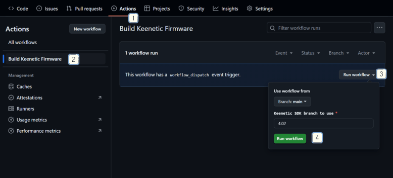
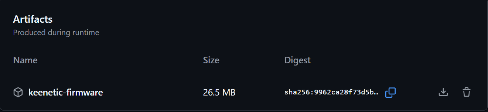
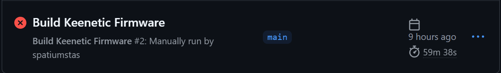

## Автоматическая сборка KeeneticOS с увеличенным встроенным хранилищем

> [!WARNING]
> **Использование на свой страх и риск!**
>
> Кастомная прошивка не лишает гарантии, однако обращение в службу поддержки будет неуместным в случае проблем.

### Использование

- [Форкните репозиторий](https://github.com/spatiumstas/keenetic-storage-enhance/fork), дальнейшие шаги выполняйте в своём форке

- Загрузите вашу прошивку с **поддержкой USB** в папку `firmware`

- Запустите сборку: [Actions](../../actions) → [Build firmware](../../actions/workflows/build.yml) → Run workflow. В поле можно указать нужный branch взятый в [SDK](https://github.com/keenetic/keenetic-sdk)

  

  На странице появится запущенный процесс сборки. Подробности о процессе можно узнать, нажав на него.

  В зависимости от количества компонентов, сборка обычно занимает от 40 до 70 минут.

  Нажмите на завершённый процесс. Архив с прошивкой будет хранится в его артефактах:

  

  - Если процесс завершится с ошибкой, индикатор статуса процесса станет красным с крестиком. Для изучения ошибки можно запустить сборку с флагом `Verbose logging`

  

### Установка прошивки

> [!WARNING]
>
> Убедитесь что текущий слот первый. Для этого ввести команду в консоли SSH `cat /proc/dual_image/boot_current`
>
> Вывод `1` - продолжаем
>
> Вывод `2` - выполнить загрузку оригинальной прошивки поверх, перепроверить

- Способ 1 (рекомендуемый) - [Keenetic Recovery](https://help.keenetic.com/hc/ru/articles/214470865-%D0%9A%D0%B0%D0%BA-%D0%B2%D0%BE%D1%81%D1%81%D1%82%D0%B0%D0%BD%D0%BE%D0%B2%D0%B8%D1%82%D1%8C-%D0%BE%D0%BF%D0%B5%D1%80%D0%B0%D1%86%D0%B8%D0%BE%D0%BD%D0%BD%D1%83%D1%8E-%D1%81%D0%B8%D1%81%D1%82%D0%B5%D0%BC%D1%83-%D0%B8%D0%BD%D1%82%D0%B5%D1%80%D0%BD%D0%B5%D1%82-%D1%86%D0%B5%D0%BD%D1%82%D1%80%D0%B0),
  положив в папку `fw` полученный файл с заменой (сохранив оригинальной название, например `KN-1012_recovery.bin`)
- Способ 2 - Положить прошивку на `встроенное хранилище` роутера. Используя скрипт [KeenKit](https://github.com/spatiumstas/KeenKit) выбрать пункт `Обновить прошивку из файла`, обновление перезапишется и роутер уйдёт в перезагрузку

### Форматирование накопителя

- После обновления размер останется старым, для определения нового объёма выполните форматирование встроенное хранилища командами в [CLI](http://192.168.1.1/a):

```shell
opkg no disk
```

```shell
no system mount storage:
```

```shell
erase storage:
```

```shell
system mount storage:
```

### Возврат оригинальной прошивки

- Для возврата достаточно снова загрузиться/обновиться на оригинальную прошивку. Встроенное хранилище будет автоматически отформатировано